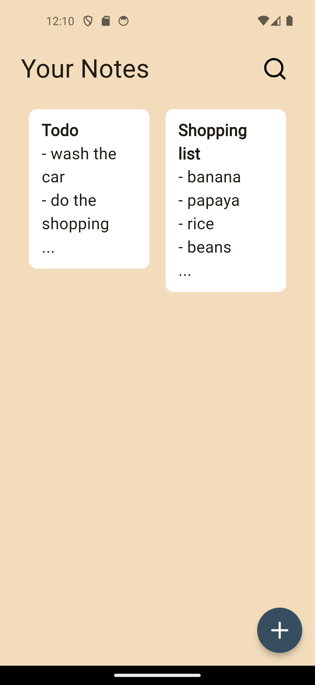
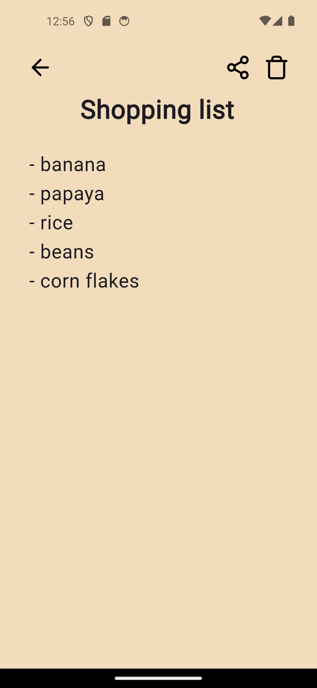
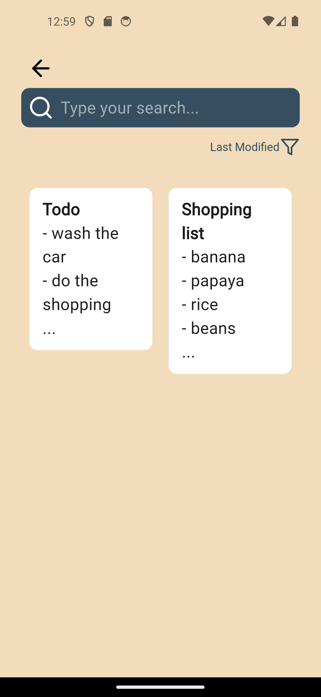

A simple notes app made using Flutter.

This project was made for our mobile systems class at [UNIVEM](https://www.univem.edu.br/). The idea was to create something simple in a couple of weeks to practice all our knowledge on mobile development.

The members of the group are:\
    - [Alexandre](https://github.com/Dpbm)(me)\
    - [Gabriela](https://github.com/Gsr13)\
    - Hugo

## Installing

For android, you can download the apk directly [here](https://github.com/Dpbm/seshat/releases/).

However, if you use IOS or want to build an APK by your own, you must take a look at:

- [Android Build](https://docs.flutter.dev/deployment/android)
- [IOS Build](https://docs.flutter.dev/deployment/ios)